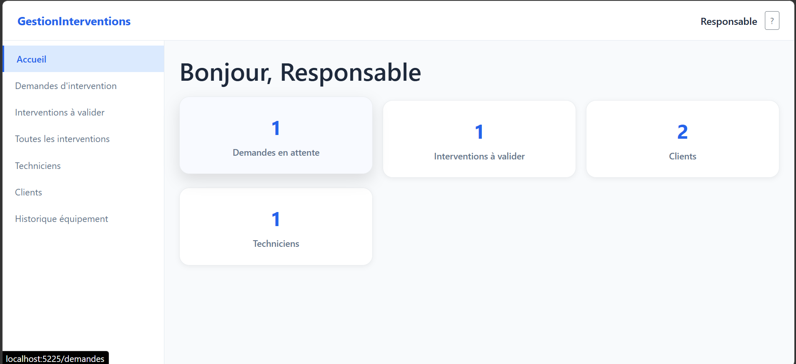
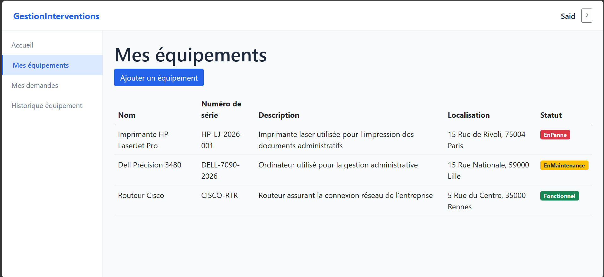
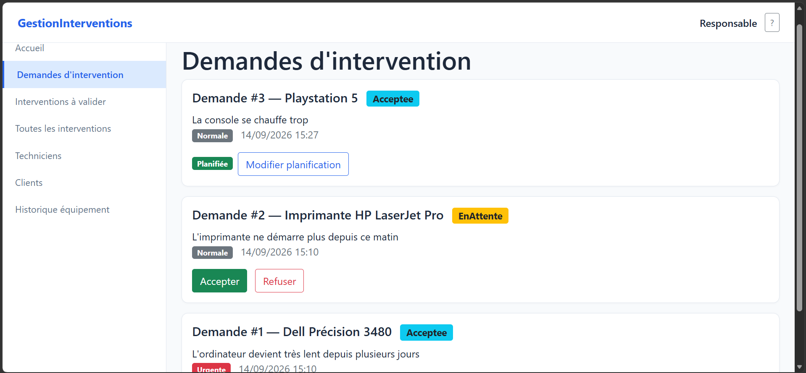
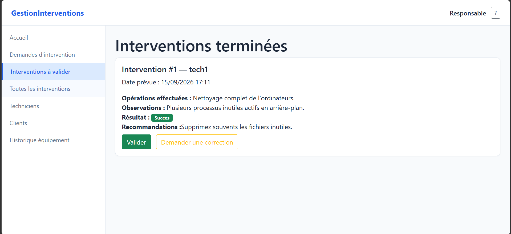

# GestionInterventions

🇫🇷 [Français](README.md) | 🇬🇧 **English**

> A full-stack technical intervention management application built with .NET, following Clean Architecture, CQRS and lightweight Domain-Driven Design principles.

## 📋 Overview

**GestionInterventions** is a technical intervention management application designed to handle the complete maintenance lifecycle of a company.

Customers can report issues with their equipment, managers can review and schedule intervention requests, and technicians can perform interventions and submit structured reports.

The project was developed as a training project to practice structured software architecture and professional development practices.

## 👥 Roles and Features

### Client

* Account registration and authentication
* Manage owned equipment
* Create intervention requests
* Track request status
* View equipment history
* View related interventions and reports
* Update personal information

### Technician

* View assigned interventions
* Start an intervention
* Complete an intervention
* Submit a structured intervention report
* Access information related to equipment and requests

### Manager

* Review pending intervention requests
* Accept or reject requests
* Schedule interventions
* Assign technicians
* Modify planned interventions
* Validate completed interventions
* Request corrections
* Manage technicians
* View clients and interventions
* View complete equipment history

Business rules are centralized in the **Domain** layer, including state transitions for requests, equipment and interventions, as well as resource ownership rules.

## 🏗️ Architecture

The project follows **Clean Architecture** with a clear separation of responsibilities.

GestionInterventions.Domain
        ↓
GestionInterventions.Application
        ↓
GestionInterventions.Infrastructure
        ↓
GestionInterventions.Api
        ↓
GestionInterventions.Web

### Domain

Contains the core business logic:

* Entities
* Enums
* Domain exceptions
* Value Objects
* Business rules and invariants

The Domain layer has no dependency on Entity Framework Core, ASP.NET Core or the UI.

### Application

Contains the application's use cases:

* Commands
* Queries
* MediatR handlers
* DTOs
* Repository interfaces
* Validation

### Infrastructure

Contains technical implementations:

* Entity Framework Core
* SQLite
* Repositories
* Unit of Work
* ASP.NET Core Identity
* JWT generation and validation
* Persistence

### API

Exposes the application through a REST API:

* Authentication
* Clients
* Technicians
* Equipment
* Intervention requests
* Interventions
* Global exception handling

### Web

User interface built with **Blazor Web App** and consuming the API.

## ⚙️ Key Technical Decisions

### CQRS + MediatR

Each use case is represented by an explicit **Command** or **Query**, with a dedicated Handler.

Command / Query
       ↓
    Handler
       ↓
Repository / Service
       ↓
     Domain

### Repository + Unit of Work

The Application layer does not directly depend on Entity Framework Core.

Repository interfaces are defined in Application, while their implementations are located in Infrastructure.

### Authentication and Authorization

The application uses:

* ASP.NET Core Identity
* JWT Bearer Authentication
* Role-based authorization
* Resource ownership validation

Sensitive configuration values are stored locally using **User Secrets** and are not committed to Git.

### Domain-Driven Design

The domain model uses:

* Behavioral entities
* Business invariants
* Domain exceptions
* `CompteRendu` as a Value Object
* Explicit business methods

For example:

Equipement.SignalerPanne()
Intervention.Terminer(compteRendu)

instead of directly modifying entity states from controllers.

### Global Error Handling

A global middleware maps domain exceptions to appropriate HTTP responses, keeping controllers thin and consistent.

## 🛠️ Technology Stack

| Area            | Technology                  |
| --------------- | --------------------------- |
| Language        | C#                          |
| Framework       | .NET 8 / ASP.NET Core       |
| API             | ASP.NET Core Web API        |
| Frontend        | Blazor Web App              |
| ORM             | Entity Framework Core       |
| Database        | SQLite                      |
| Architecture    | Clean Architecture          |
| Design          | Domain-Driven Design        |
| Pattern         | CQRS                        |
| Mediator        | MediatR                     |
| Authentication  | ASP.NET Core Identity + JWT |
| UI              | Bootstrap                   |
| Version Control | Git / GitHub                |

## 📸 Screenshots

### Dashboard

### Equipment Management

### Intervention Requests

### Intervention Management

> Screenshots showcase the main interfaces of the application.

## 📁 Project Structure

GestionInterventions/
│
├── src/
│   ├── GestionInterventions.Domain/
│   ├── GestionInterventions.Application/
│   ├── GestionInterventions.Infrastructure/
│   ├── GestionInterventions.Api/
│   └── GestionInterventions.Web/
│
├── screenshots/
│   ├── accueil.png
│   ├── equipements.png
│   ├── demandes.png
│   └── interventions.png
│
├── GestionInterventions.sln
├── README.md
├── README_EN.md
└── .gitignore

## 🚀 Getting Started

### Prerequisites

* .NET 8 SDK
* Git
* `dotnet-ef`

Install the Entity Framework CLI tool:

dotnet tool install --global dotnet-ef

### Clone the repository

git clone https://github.com/madjidaouam7/GestionInterventions.git
cd GestionInterventions

### Restore and build

dotnet restore
dotnet build

### Configure secrets

Required application secrets must be configured using **User Secrets**.

Initialize User Secrets:

dotnet user-secrets init --project src/GestionInterventions.Api

Set the Manager password:

dotnet user-secrets set "SeedAdmin:Password" "YOUR_PASSWORD" --project src/GestionInterventions.Api

Set the JWT signing key:

dotnet user-secrets set "Jwt:Key" "YOUR_JWT_KEY" --project src/GestionInterventions.Api

> Never commit real secret values to the GitHub repository.

### Apply database migrations

dotnet ef database update --project src/GestionInterventions.Infrastructure --startup-project src/GestionInterventions.Api

### Run the API

In one terminal:

dotnet run --project src/GestionInterventions.Api

### Run the Web application

In a second terminal:

dotnet run --project src/GestionInterventions.Web

## 🔐 Manager Account

A Manager account is automatically created when the application is initialized.

For security reasons, the password is not stored in the repository and must be configured locally using **User Secrets**.

Client accounts can be created through public registration, while Technician accounts can be created by a Manager.

## 📌 Project Status

This is an individual training project developed to practice the design and implementation of a structured ASP.NET Core web application.

The project focuses on:

* separation of concerns;
* domain-driven design;
* CQRS and MediatR;
* dependency injection;
* data access with Entity Framework Core;
* authentication and authorization;
* REST API design;
* building a user interface with Blazor.

## 📄 License

This project is intended for educational, portfolio and technical demonstration purposes.
